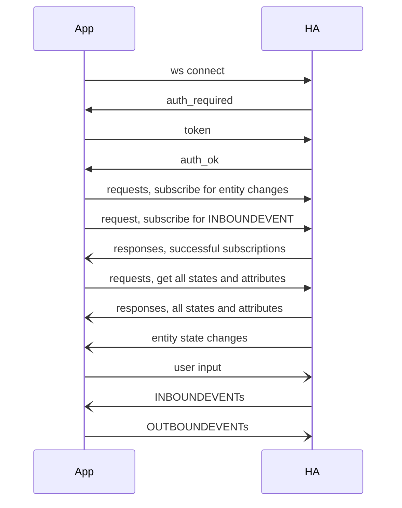

# Om GIT på svenska
### source control
verionshantering
### to commit 
**lägga tillbaka, hänga tillbaka** - att lägga tillbaka en eller flera modifierade filer i den aktuella grenen
Korgen hängs tillbaka på den aktuella grenen.
### to branch
**grena upp** - att från aktuell gren göra en sidogren med avsikten att utveckla den vidare utan att påverka den aktuella grenen 
### to stage
**(ordna in, lägga till,) samla ihop** - att markera att en ny eller modifierad fil hör till grenen
Nya och modifierade filer samlas ihop i en korg.
### to stash
**gömma undan** - att temporärt skapa en identifierbar mellanversion som man ska fortsätta jobba med strax
### to merge
**slå ihop** - att utöka huvudgrenen med vad som finns i en sidogren 


https://github.com/bjorne/git-pa-svenska

https://gist.github.com/kmpm/21a9ede21c49904c98063cd51c56bad1


<details>


<summary>Demo av mermaid</summary>


    <-----> HA     
    --> ws connect 
    
    <-- auth_required  
    --> token
    <-- auth_ok

    --> requests: subscribe for entity changes
    --> request:  subscribe for INBOUNDEVENT 
    <-- responses: successful subscriptions
    --> requests: get all states and attributes
    <-- responses: all states and attributes

    <-- entity changes
    --> user input
    <-- 'to_gridpanels_event'
    --> 'from_gridpanels_event'


        If GET: get username and password token from cookies
        If POST: get username and password from login form
        Check access rights and return HTML page if OK.
        If not, return login form.


### App communication with HA


### User connects to get page
```mermaid
sequenceDiagram
    participant User
    participant Browser
    participant App

    User->>Browser: surf to gridpanels.html
    Browser->>App: GET gridpanels.html 
    alt user/pass in cookies and OK
        App->>Browser: HTML page and set cookies
        Note over App,Browser: Now user can interact with page
    else missing
        App->>Browser: Login form
        User->>Browser: fill out login form
        Browser->>App: POST user/pass 
        alt user/pass is OK
            App->>Browser: HTML page
        else not OK
            App->>Browser: Login form
        end
    end    
 ```
### User interacts with page
```mermaid
sequenceDiagram
    participant User
    participant Browser
    participant App
    participant HA
    App->>Browser: HTML page
    HA-)App: entity state changes
    App->>Browser: update page
    User-)Browser: click in cell
    Browser->>App: cell is clicked
    App->>HA: call service for entity

 ```
</details>

<details>

<summary>Verkstan och förrådet</summary>

Antag att det finns en verkstad och ett förråd. 

Verkstan är där utvecklingsarbete sker genom att samhörande filer testas, skapas, förändras och tas bort.  

I förrådet lagras både nya och gamla filer. Förrådet är organiserat som ett träd med grenar.

På olika ställen på en gren hänger antingen en korg med filer eller så utgår en ny gren därifrån.

Från en gren i förrådet kan verkstan beställa fram de nyaste filerna som finns där. När filerna kopieras till verkstan blir grenen verkstans aktuella gren.

I verkstan testas och förbättras filerna och när verkstan anser sig nöjd för tillfället samlas alla förändringar ihop i en korg.

I korgen bör också läggas en beskrivning av vad som har ändrats.
Korgen hängs upp i änden på den aktuella grenen, som då växer ut. 
Verkstan kan fortsätta arbetet till dess man återigen är nöjd och göra en ny korg som hängs in på den aktuella grenen.
Men verkstan kan, istället för att hänga in en korg på den aktuella grenen, skapa en ny gren i änden på den aktuella grenen och hänga in korgen där. 
Det blir nu den aktuella grenen som arbetet i verkstan avser.
Efter att ha hängt in en korg på den nya, aktuella grenen kan verkstan välja att istället fortsätta på den gamla grenen.
Alla filer för den aktuella, nya grenen är nu säkrade i förrådet.
När verkstan beställer de senaste filerna från den gamla grenen så är det bara de filerne som hamnar i verkstan och arbetet kan fortsätta.
Ofta vill verkstan tillföra de förbättringar som gjordes i den nya grenen, till den nya grenen. 
Det görs genom att slå ihop den gamla med den nya grenen. 
När en fil inte har förändrats i den gamla grenen efter det att den nya skapades, är det bara att ersätta den gamla med den nya.
Om inte så är fallet måste verkstan analysera vilka skillnaderna är och manuellt göra de modifieringar som krävs.
När detta är gjort kan arbetet i verkstan fortsätta som vanligt. Den gamla grenen är återigen den aktuella.

Om verkstan måste pausa arbetet utan att anse sig nöjd så går det att temporärt gömma undan det som finns i verkstan.

Verkstan kan inte bara beställa fram de filer på en gren som tillsammans utgör den senaste versionen. 
Med hjälp av beskrivningarna som finns i en grens korgar kan verkstan även hitta och beställa fram tidigare versioner. 
Om verkstan ändrar i filerna och vill spara dem i förrådet, måste först en ny gren skapas. 
 
</details>


